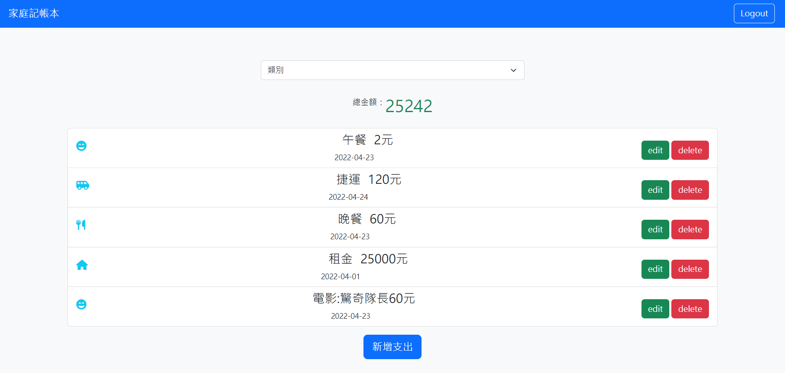

# 



## 介紹
網頁版的記帳簿

### 功能
- 顯示支出總額
- 列出所有支出細節
- 可以照支出種類分類顯示
- 新增一筆支出
- 修改支出資料
- 刪除餐廳功能
- 以信箱建立帳號
- 密碼以加密形式儲存於資料庫

## 開始使用

1. 請先安裝 node.js 與 npm
2. 將專案 clone 到本地
3. 在本地開啟之後，透過終端機進入資料夾，輸入：

   ```bash
   npm install
   ```

4. 安裝完畢後，輸入：

   ```bash
   npm run start
   ```

5. 看見此行訊息代表成功運行，可用瀏覽器進入到以下網址

   ```bash
   Listening on http://localhost:3000
   ```

6. 結束運行輸入

   ```bash
   ctrl + c
   ```

## 開發工具

- Node.js 14.16.0
- Express 4.16.4
- Express-handlebars 3.0.0
- Bootstrap 4.3.1
- Mongoose 5.9.7
- Express-session1.17.3
- Passport: 0.4.1
- Passport-local: 1.0.0
- Passport-facebook: 3.0.0
- Bcryptjs: 2.4.3,
- Connect-flash: 0.1.1
- Dotenv: 8.2.0